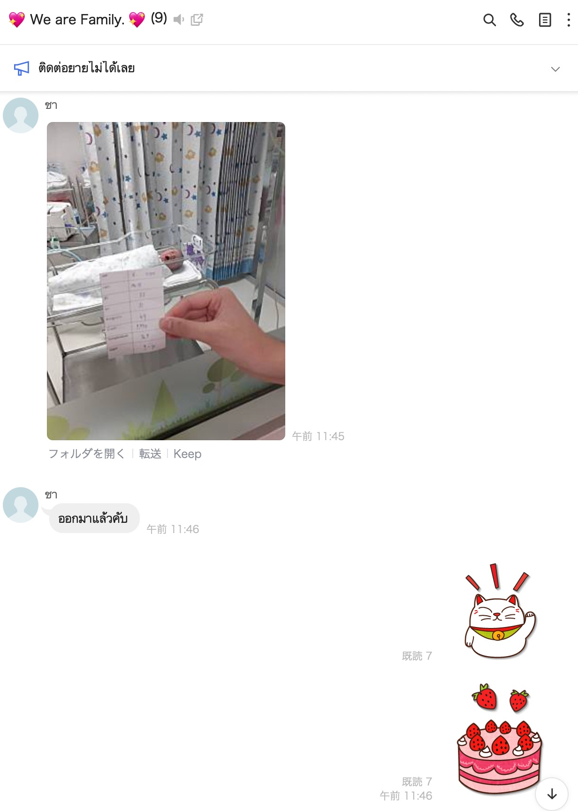
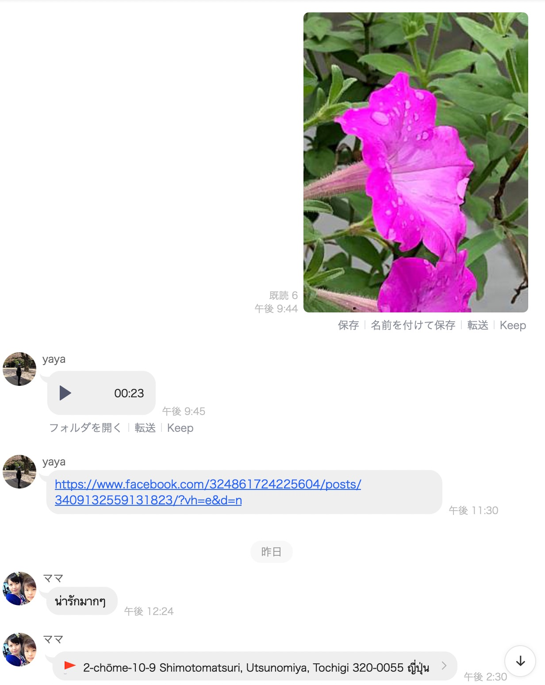
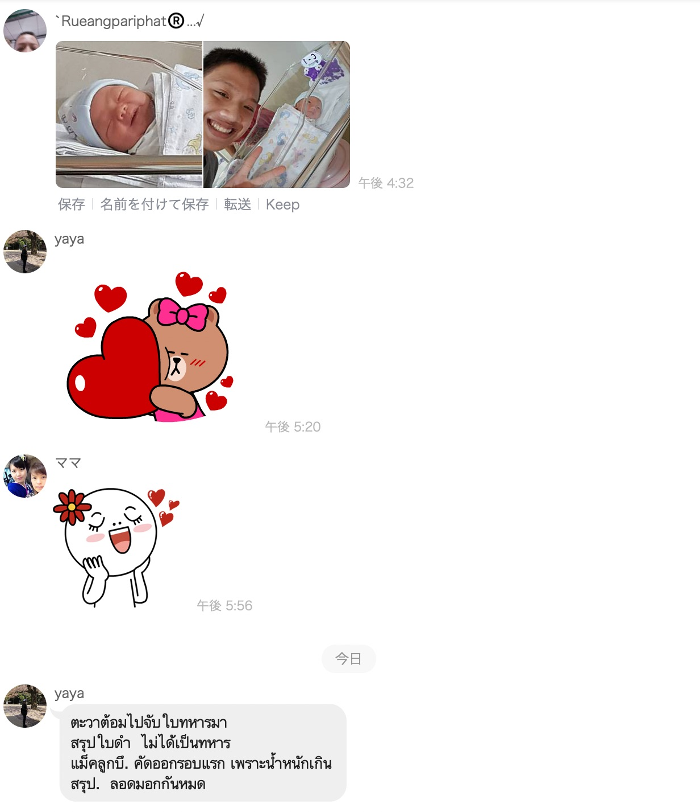
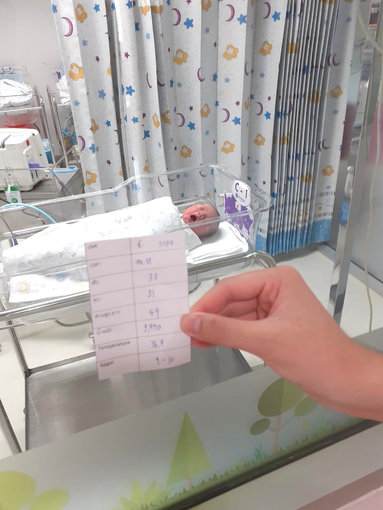

# birthday

<html lang="ja">
 <head>
 <meta charset="UTF-8">
 <title>วันเกิด_2020/07/26</title>

<link rel="stylesheet" href="../style.css/" type="text/css">
  

</head>

<link href="https://cdnjs.cloudflare.com/ajax/libs/lightbox2/2.7.1/css/lightbox.css" rel="stylesheet">

<body>

birthday</a>><a href="https://yayaploy.github.io/birthday_pic">birthday_pic</a>

                           

 アクセス用QRコード

<marquee direction="right" scrollamount="20" width="30%">(^_^)/~hada</marquee>

<h1><marquee behavior="alternate">!!! วันเกิด/birthday/誕生日 2563/07/26 !!!</marquee></h1>

<iframe width="560" height="315" src="https://www.youtube.com/embed/haWIQZuMXxg" frameborder="0" allow="accelerometer; autoplay; encrypted-media; gyroscope; picture-in-picture" allowfullscreen></iframe>

<iframe width="560" height="315" src="https://www.youtube.com/embed/1JiHj8yuRo4" frameborder="0" allow="accelerometer; autoplay; clipboard-write; encrypted-media; gyroscope; picture-in-picture" allowfullscreen></iframe>

<iframe width="560" height="315" src="https://www.youtube.com/embed/M8HRf3UYGeM" frameborder="0" allow="accelerometer; autoplay; clipboard-write; encrypted-media; gyroscope; picture-in-picture" allowfullscreen></iframe>

<iframe width="560" height="315" src="https://www.youtube.com/embed/TYmD_xWVFZ8" frameborder="0" allow="accelerometer; autoplay; clipboard-write; encrypted-media; gyroscope; picture-in-picture" allowfullscreen></iframe>

<iframe width="560" height="315" src="https://www.youtube.com/embed/CxJw9s7r67M" frameborder="0" allow="accelerometer; autoplay; clipboard-write; encrypted-media; gyroscope; picture-in-picture" allowfullscreen></iframe>

  
<audio controls>
<source src="_58376220.mp3">
<source src="_58376220.ogg">

HTML5のaudioに対応していないブラウザのためサンプルは表示されません。

</audio>

     

                            <audio style="max-width: 100%" controls="controls">
                                このブラウザでは再生できません。
                                <source src="_58376220.mp3">
                            </audio>
                             
                            再生できない場合、ダウンロードは&#x1F3B5;
                            <a href="https://blog.seesaa.jp/pages/tools/download/index?d=eac7831b2e0ba0feac3a20bf1abd4c82&u=https://qrl-599.up.seesaa.net/image/QRL_432_library.mp3">こちら</a>
                        

<!--
<video>
<source src='sample.ogv' type='video/ogg; codecs="theora, vorbis"'>
<source src='15803.t.mp4' type='video/mp4; codecs="avc1.42E01E, mp4a.40.2"'>

動画を再生するには、videoタグをサポートしたブラウザが必要です。

</video>
-->
<!--
<audio preload="metadata" controls>
<source src="_58376220.m4a" type="audio/aac">
</audio>
-->

   

   

                                      

<!-- フッタ -->
 <footer>
 
Copyright 2020/07/28 S.Hada

 </footer>
